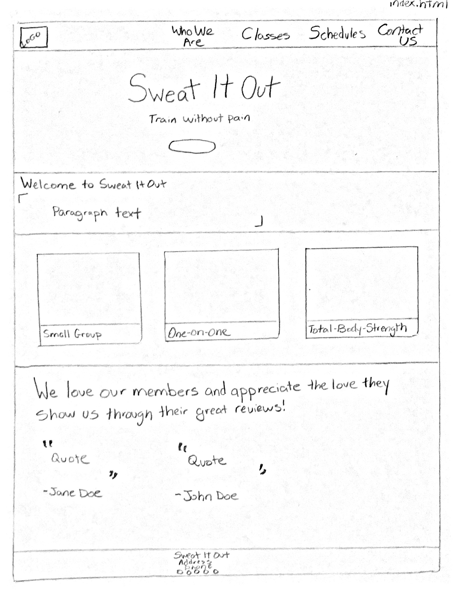
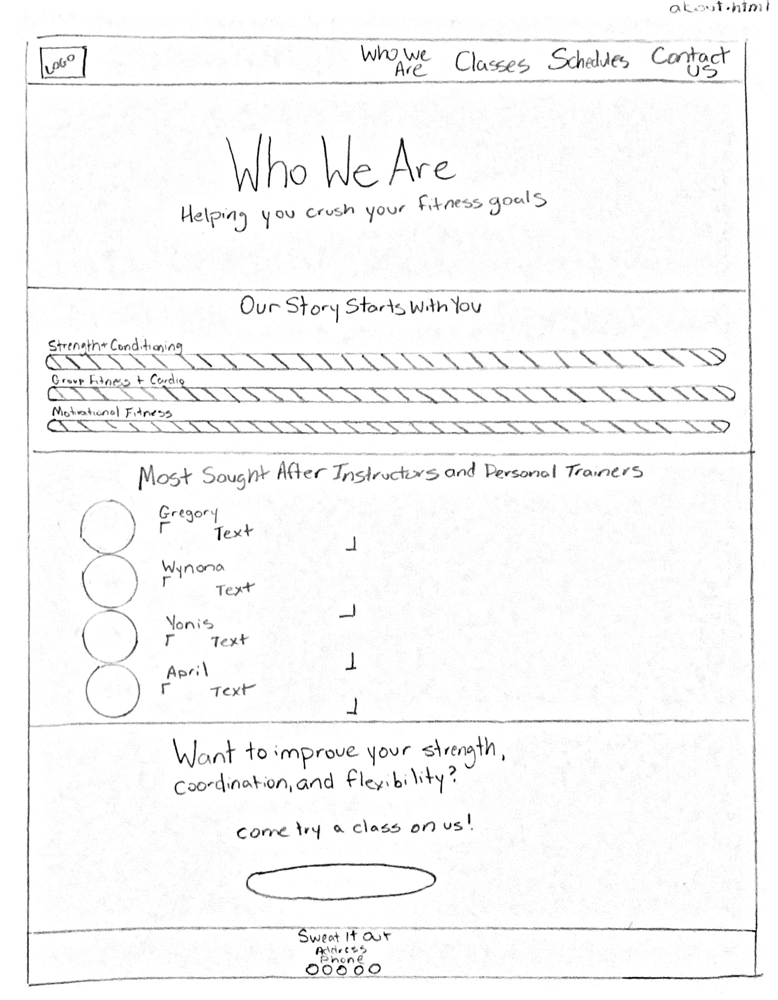
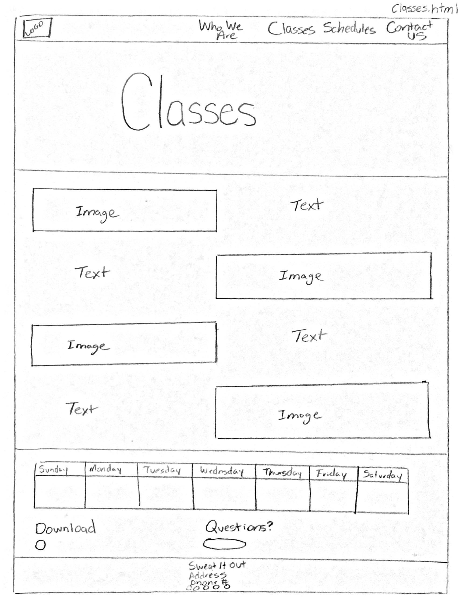
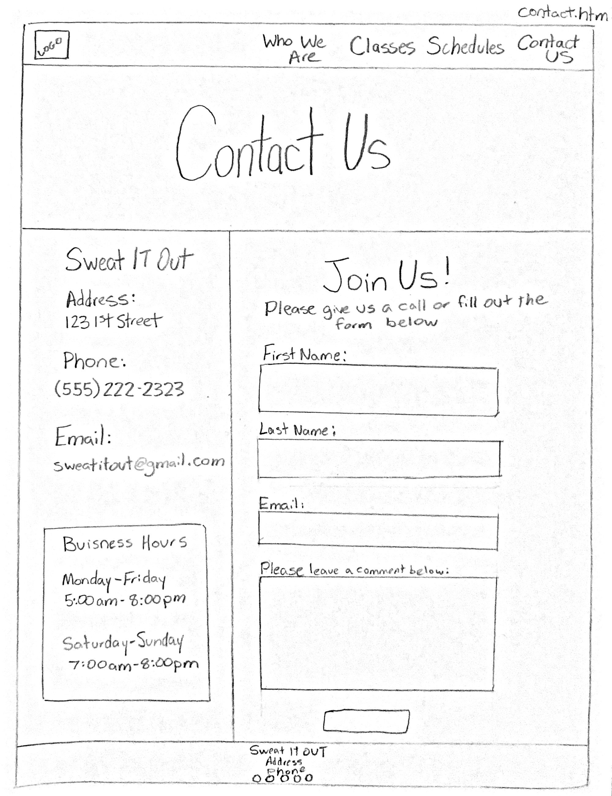
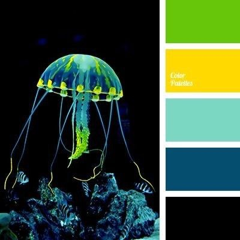
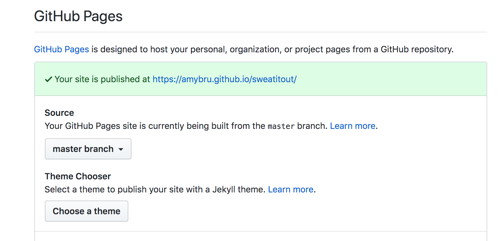

# Sweat It Out Gym
Welcome to Sweat It Out's Website. This is a fictional gym created for my first milestone project (User Centric Frontend Development) at Code Institute.

I was insprired to design this website with a modern, geometric, bold design based on how I would personally feel when trying to find a new gym. I chose to use a few electric colors that would pop off the screen to give the user a pleasant first-impression of the company. I also chose a large bold font to use for the headings of the sections and to attract attentions to the buttons. Many images were used so the customer could get a feel for what they would be signing up for. Users of this website are not likely to visit to read lots of information, so the text content was condensed and long paragraphs were avoided.  

The website has two major purposes. The first purpose is to attract new customers into joining the gym. The other purpose is to help existing customers to see what the current schedule is and how they can contact the gym.

## UX
#### User Stories

As a user of this website, I would like to see what classes are offered at this gym.

As a user of this website, it would be very useful for me to be able to quickly find the contact information of this gym, including; the address, phone number, and email.

As a user of this website and existing customer, it would be convenient for me to see the current schedule of classes in an easy to find location.

As a user of this website and a new customer, I would like to know who the instructors and trainers are as well as their qualifications and experience.

As a user of this website, I would be interested in seeing what others have to say about their experience with this gym. 

#### Wireframes
All wireframes were hand drawn based on the desktop site.

These are the colors used throughout the website. The color palate below was found on Pinterest. 

## Features
Clicking the logo on the navigation bar will bring you back to the home page. The logo will also increase in size when you hover over it on laptop and desktop screens.

The navigation bar can be toggled on and off on both Mobile and Tablet screen sizes.

On the mobile and tablet screen sizes, the "Schedules" link in the navigation bar will disapear. 

Clicking the each of the links under the dropdown menu in the navigation bar (Schedules) will open an appropriate PDF in a seperate page.

Clicking the "Join Today" button on the home page will open a modal with a sign-up form.

Links in the footer will take you to the company's respective social media pages. 

#### Features Left to Impliment
I would like to add a page called "Success stories" that will give new customers a better feel of how they will benefit from joining this gym. This section will feature testimonials given by current customers.

## Technologies
#### HTML5:
HTML5 was used to provide the content of the site.
https://en.wikipedia.org/wiki/HTML

#### CSS3:
CSS3 was used to apply styles to the site.
https://en.wikipedia.org/wiki/Cascading_Style_Sheets

#### Bootstrap 4:
This site uses Bootstrap 4 to add extra features and allow the HTML to be more responsive.
https://en.wikipedia.org/wiki/Bootstrap_(front-end_framework)

## Testing
Google Chrome Developer tools were used to test the responsiveness of each page and to change the viewport and screen size.

Free Formatter (www.freeformatter.com/html-formatter.html) was used to make sure my HTML was formatted in the proper way. 

HTML was validated at https://validator.w3.org 

CSS was validated at https://jigsaw.w3.org/css-validator/ 

#### User testing
The following tests were performed to test usibility and functionality. At the time of a final testing, all features passed the functionality test as expected.
* Using the links in the navigation bar will take the user to each of the pages on the website
* Clicking on the logo icon on the navigation bar will bring the user back to the home page
* Hovering over the logo image will cause the image to increase in size
* Opening the dropdown menu (titled "Schedules") located in the navigation bar and clicking each of the three links will open an appropriate PDF in a seperate window.
* Clicking the "JOIN TODAY!" button on the home page will open a modal for the user to sign up as a customer
* Filling out the modal form will require the user to input their email in the proper format
* Hovering over the three cards on the homepage will cause them to increase in size
* Clicking the "SEE MORE" button on the home page will take the user to the "Classes" page
* Clicking the "CLICK TO READ MORE GREAT REVIEWS" button on the home page will bring the user to https://yelp.com
* Clicking the "SIGN UP FOR A FREE CLASS" button on the "Who We Are" page will bring the user to the "Contact Us" page
* Clicking the download icon on the "Classes" page will open a PDF in a seperate window
* CLicking the "SIGN UP TODAY" button on the "Classes" page will take the user to the "Who We Are" page
* The form on the "Who We Are" page will require the user to fill out the first name, last name, and email sections in the proper format.
* Hovering over any of the buttons will change the background color and font color
* In the footer, clicking the Facebook icon will take the user to https://facebook.com
* In the footer, clicking the Yelp icon will take the user to https://yelp.com
* In the footer, clicking the Google+ icon will take the user to https://google.com
* In the footer, clicking the Instagram icon will take the user to https://instagram.com
* In the footer, clicking the Twitter icon will take the user to https://twitter.com

## Bugs
The following bugs were found when performing the initial tests. 

The navigation bar functioned as it should, but when collapsed, the hamburger icon did not appear. There were several styles that were causing this to happen. These were changed to make the navigation bar function as expected.

A formating issue existed on the "Who We Are" page for the instructors. Additional styles were applied to correct this.

There was a margin-right that caused a white gap on mobile and tablet screens. This was removed from the CSS to eliminate this issue.

There was a margin bottom on the footer. This was due to a margin on the .social-links class. This margin-bottom was removed to push the dark blue color of the footer to the bottom of the page.

I had some sizing issues on the classes page for different screen sizes, especially on tablet. A few styles were added to make the content more pleasing to look at.

## Deployment
This project was created and developed through the use of AWS Cloud9. A local repository was used to add and commit add any changes or new features to the site. Commits to the local respository were pushed to GitHub.

The repository for this website can be found at this GitHub link: 
https://github.com/amybru/sweatitout

The site was published with GitHub Pages. 
https://amybru.github.io/sweatitout/

To accomplish the publishing of the website, the following steps were carried out:
1) When in the repository, navigate to the settings 
2) Scroll down to GitHub Pages
3) Under the section "Source", there is a box with "None" chosen as the option.
4) Click it and select "master branch"
5) Click on the url to visit the published website

## Acknowledgement
#### I would like to thank and credit the following sources for their help:

* My mentor with Code Institue, Reuben Ferrante

* The community at Slack 

* The videos in the Code Institue course for helping me to understand what each of the elements do

* All Photos were taken from Unsplash (https://unsplash.com/).

* The logo seen in the navbar was created at Wix Logo Maker (https://www.wix.com/logo/maker).

* Icons were taken from Font Awesome (https://fontawesome.com/?from=io).

* All fonts are from Google Fonts (https://fonts.google.com). 

* Inspiration was taken from several local gyms near my hometown. 